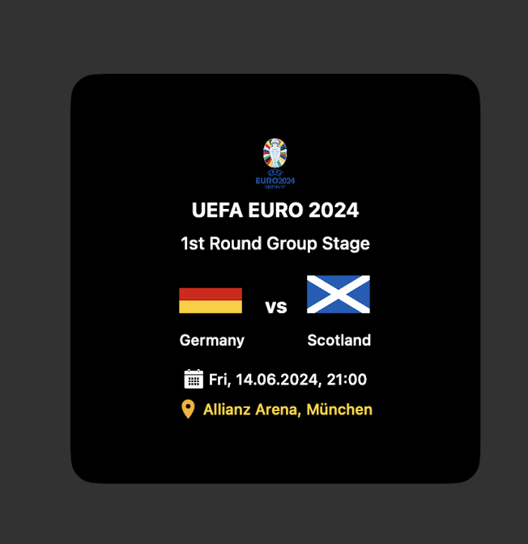

# euro-2024-ticker-widget

A Scriptable widget that shows the next euro 2024 match.

 

   <a href="#description">Setup</a> • 
   <a href="#setup">Setup</a> •
   <a href="#usage">Usage</a> •
   <a href="#links">Links</a> •
   <a href="#contribution">Contribution</a> •
   <a href="#roadmap">Roadmap</a> •
 

## Description

This is a Scriptable widget that displays information about the next Euro 2024 match. It provides a convenient way to stay updated on upcoming matches. The widget can be customized and added to the home screen for easy access. It fetches data from OpenligaDB. The widget requires the Scriptable app, which can be downloaded from the App Store. Feel free to contribute to this project by suggesting extensions or changes.

## Setup

1. (if not done yet) Download the scriptable app form [AppStore](https://apps.apple.com/de/app/scriptable/id1405459188)
2. In Scriptable create a new script
3. Copy the code from script file [euro-2024-ticker-widget.js](https://github.com/wickenico/euro-2024-ticker-widget/blob/main/euro-2024-ticker-widget.js)
4. Create a new widget on homescreen and select this script in scriptable

## Usage

No parameters at the moment.

## Links

OpenligaDB: https://www.openligadb.de/Spielplan/em/2024

## Contribution

If you have any ideas for extensions or changes just let me know.

## Roadmap

- DONE: Add logo
- Add parameter for languages de / en
